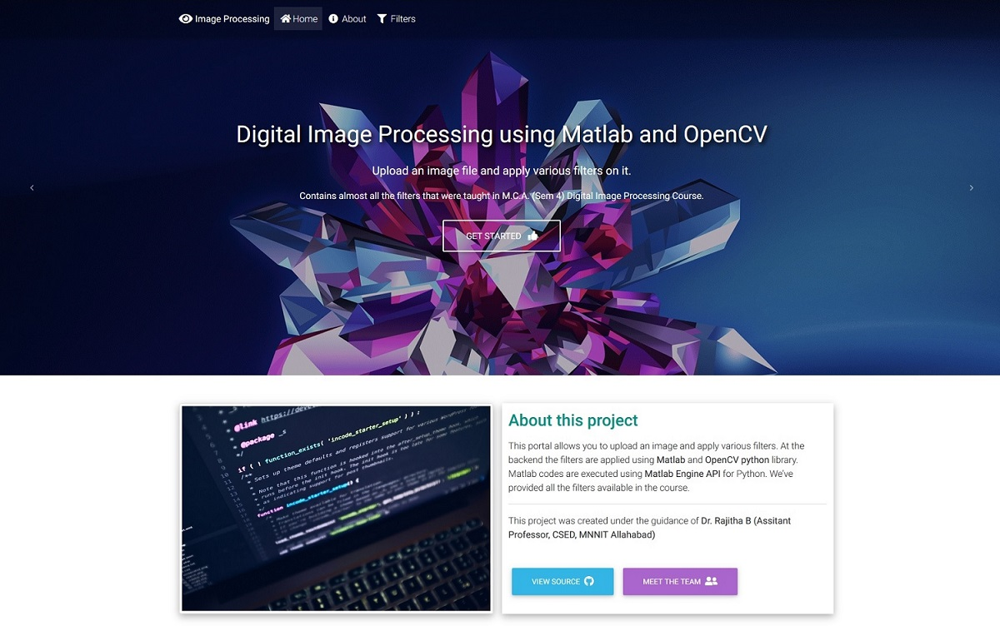
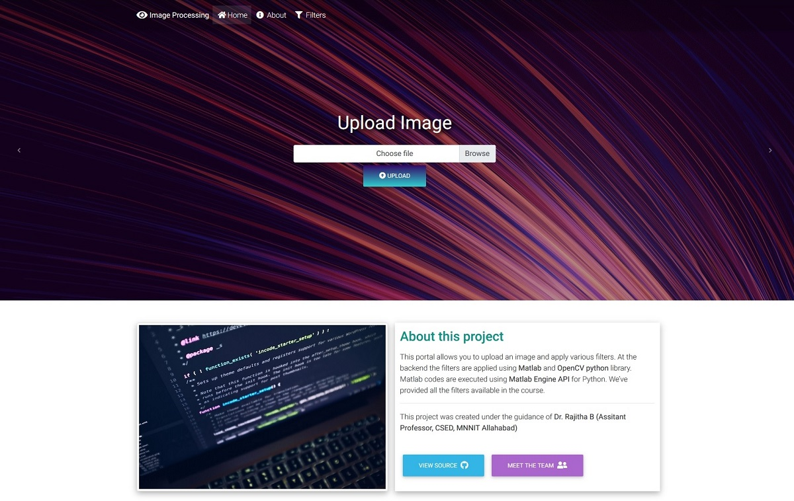
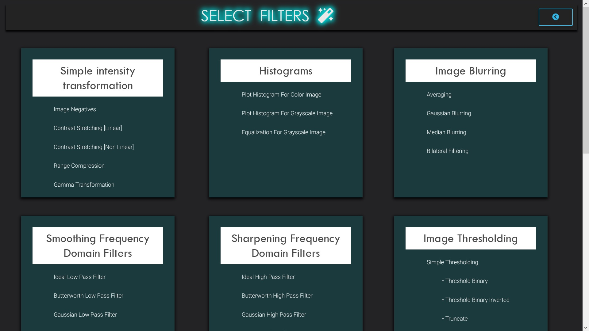
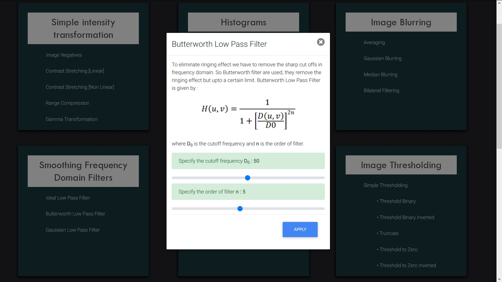
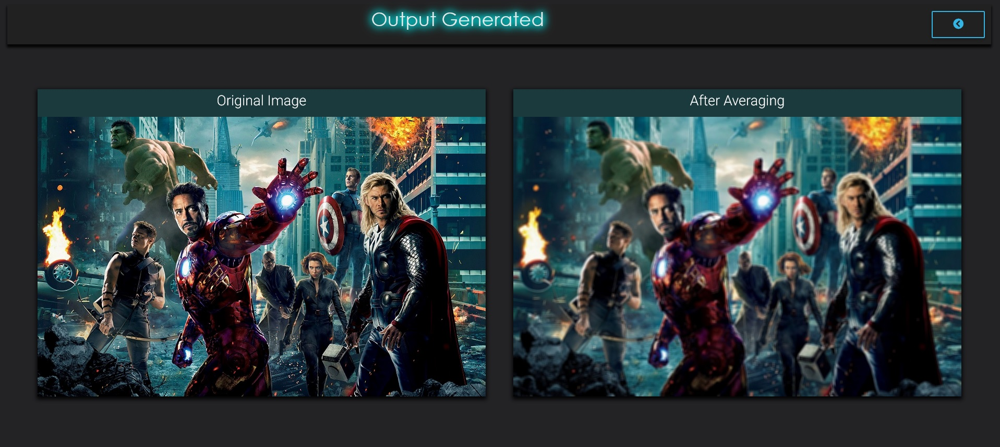

# ImageProcessing-webPortal
A web portal that allows to upload an image and apply various filters and effects on it. It contains various filters for Simple Intensity Transformation, Image Blurring, Smoothing and Sharpening Frequency Domain Filters, Image Thresholding, Morphological Transformation, Image Gradients etc.
The filters are applied using OpenCV and MATLAB image processing libraries.

- Home Page

- Upload Image

- Select Filter

- Adjust some parameters

- Output Page

